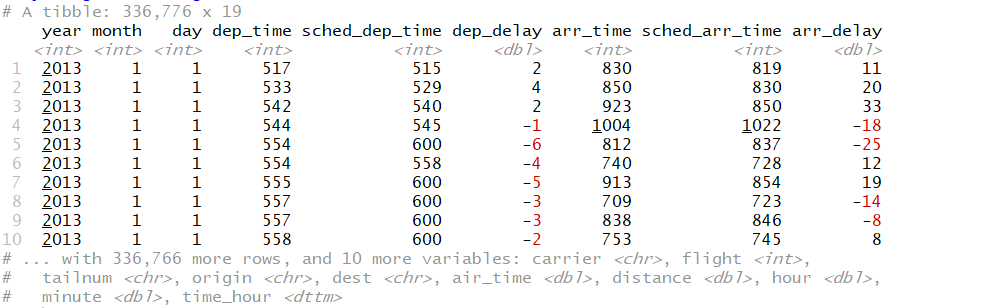

```{r setup, include=FALSE}
knitr::opts_chunk$set(echo = TRUE)
```

You will try to establish your own script. 

1. Create a new folder called "Lab5". 

2. Create a subfolder called "data".

3. Open RStudio, establish a new project under Lab5. 

4. Go to File---New file---R script. Name it as Lab5.r. Save this script under Lab5 folder. 


## Part 1: Exercise
Let's pull together everything we've learned to answer all these questions below using the `flights` dataset. 




### Load dataset:
Type and execute the script below. 
```{r}
library(nycflights13)
data(flights)
```

This `flights` datasets contains all 336,776 flights that departed from New York City in 2013. It is originally collected from the US Bureau of Transportation Statistics. 
Try to use `?flights` to know more about it. 


Please refer to the slides or the cheatsheet, select a proper function to finish the following tasks. We will suggest to use pipes. 

Shortcut for pipe: SHIFT+CTRL+M


## Task 1: 
Calculate the percentage of the flights that have an arrival delay of two or more hours. 


Details: Use the column called arr_delay to `count` how many of the 336776 observations have arrival delay >= 2 hours. Note the column for arrival delay is measured in minutes. So you can set arr_delay >= 120. Save this number as a new data called `n`. 

Type and execute the script below. 
The basic idea is first `filter` then `count` 
```{r eval=F}
n <- flights %>% filter(arr_delay>=120) %>% count
n/336776

```
You get 0.03 as the output. That means only 3% of the flights will have an arrival delay more than 2 hours!

### Task 2: 
What is the percentage of the flights that weren't delayed (on both arrival or departure) by more than half an hour. 

You will try to use `!` here. `!`means not, and `|` is the logical or.    
Type and execute the script below. 
```{r eval=F}
n <- flights %>% filter (!(arr_delay >30|dep_delay >30)) %>% count

n/336776

```

The result is not bad too. 79% of the flights will not be late more than half hour both for arrival and departure. 

## Task 3: 
How many destinations are there in this dataset?

The column we will use is `dest`. 
We can use function `unique` to figure out which are the unique values, and then use `length` to know how many destinations do we have. 
Type and execute the script below. 
```{r eval=F}
flights$dest %>% unique %>% length
```
There are 105 destinations in total. 

## Task 4: 
Among these 105 destinations, which destination has the highest average arrival delays in minute?

Type and execute the script below. 
The basic idea is: group the dataset by destination. Then summarize the average arrival delay in minute, and name the new column `ave_delay`. The last step is to rank (use arrange) in an descending order to figure out which destination has the highest average arrival delay. 
```{r eval=F}
flights %>% group_by(dest) %>% 
    summarise(ave_delay=mean(arr_delay,na.rm=T)) %>% arrange(desc(ave_delay))
```

The answer is: CAE. So the Columbia Metropolitan Airport in South Carolina perform the worst in terms of arrival delays. 

## Task 5: 
For task 4, we only considered arrival delays. Now let's try to add departure delay and arrival delay together, to figure out which destination has lowest average delay in total, and which destination has the highest average delay in total. The total delay should be the sum of arrival delay and departure delay. 

Note for arr_delay and dep_delay, negative values indicate the flight depart or arrive ahead of time. 

Type and execute the script below. 
The basic idea is, we need to new column to save the delay of minute in total (Name it Total_delay). Then summaries average delay in total by destinations. Save the summaries results as a new data called delay_summary.  The last step is to rank delay_summary in both ascending and descending order. 
```{r eval=F}
delay_summary <- flights %>% mutate(Total_delay=dep_delay+arr_delay) %>% 
    group_by(dest) %>% summarise(ave_total_delay=mean(Total_delay,na.rm=T))

arrange(delay_summary, delay_summary$ave_total_delay)
arrange(delay_summary,desc(delay_summary$ave_total_delay))
```

So on average, LEX airport performs the best, with lowest total delay time, while CAE still performs the worst. 

You might try similar functions to figure out which carrier perform the best and worst in terms of total delay time. 


You are done with part 1. You do not need to submit anything for part1. 

# Pipe: SHIFT+CTRL+M

## Part 2: HOUSEHOULD INCOME ANALYSIS USING ACS DATA

Now we will work with the American Community Survey Dataset.See details from https://www.census.gov/programs-surveys/acs 

As suggested from the official website, the U.S. Census Bureau’s American Community Survey (ACS) is designed to answer all types of questions and to meet the needs of policymakers, business leaders, planners, and others nationwide who need good data to make informed decisions. 

The dataset includes information from 2013-2017 5-year ACS at county level across entire country.

Below is the preview of dataset. 

Column name  | Description
------------- | -------------
GEOID  | Numeric codes that uniquely identify all administrative/legal and statistical geographic areas for which the Census Bureau tabulates data
County  | County Name
State | State Name
hhincome | Median Household income 
medage | Median Age
pop| Population in Total
White | Total population White alone
Black | Total population Black or African American alone
Native | Total population American Indian and Alaska Native alone
Asian | Total population Asian alone

   

### Load dataset:

```{r echo=F}

xfun::embed_file('data/CENSUS2017_county_raw.csv')


```

Type and execute the script below. 
```{r eval=F}
library(tidyverse)
census_import <- read_csv("data/CENSUS2017_county_raw.csv")

```

This census datasets contains 3220 rows and 16 columns.  

## Question 1 (10 points): 
Is this data clean? Double check the preview of the ideal table, and use proper functions we have introduced in these two weeks to fix the issues.

Name the new clean data as "census_clean". You should only have 3220 rows and 10 variables (GEOID, County, State, hhincome, medage,pop, White, Black, Native, and Asian).

***Please copy and paste your script into the word document to answer question 1. ***


## Question 2 preps: 
Household income is the combined gross income of all members of a household who are 15 years or older. It is an important economics indicator of a county's standard of living: economists use household income to evaluate the economic health of a given area/county. Let's find out average median  household income (column `hhincome`) for all the records, which gives us the average median household income of the entire country.

Type and execute the script below:
```{r eval=F}
mean(census_clean$hhincome,na.rm=T)
```
## Question 2 (10 points):
Based on the average value you get in Question 2 preps, ***what percentage of the counties' median household income are higher than the average?***You just need to report the percentage in your answer. 


# Question 3 (10 points):
***Which state has the highest average median household income? What is the average median household income for that state?***

Hint: you should `group` the data by state, and then `summarise` the average household income for each state. The last step is to rank (using `arrange` function in descending order) the results to find the top record. Pipes are highly recommended here.


# Question 4 (10 points):
Race data are used in planning and funding government programs that provide funds or services for specific groups. Also, these data are used to evaluate government programs and policies to ensure that they fairly and equitably serve the needs of all racial groups and to monitor compliance with antidiscrimination laws, regulations, and policies. In this dataset, 5 race groups are included.

***Which county has the highest percentage of "Asian" population? Can you explain why (e.g. history of Asian migration)?***  Just type your answers in a few words in the word document. 

Hint: add a new column first to store the precentage of Asian population. Name the new column `pec_asian`. Then rank this column in descending order. 


# Question 5 (10 points):
***For each state, which county has the largest total population within that state?***

You should return this result as a new table, called max_pop. This max_pop table should only contains these columns: ***GEOID, County, State, and pop***. The table should be ranked by state name in alphabetical order (A-Z). Submit a screenshot as a preview of this max_pop dataset. Just include first 10 rows and 4 columns. 

Hint: you should get 52 rows and 4 columns for this max_pop data. 
To filter out which county has the largest population, use `filter(pop==max(pop))`. 

Suggested functions: `group by`, `filter`, `select` and `arrange`. 


You are done with part 2. Submit your answers in a word document in Canvas. 

